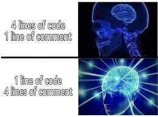

# FuncMage

* Learn about functional programming in python .

  

| Exercise                        | Topic                  |
|---------------------------------|------------------------|
| [Ex0: Lambda Sanctum ](src/ex1) | Lambda functions       |
| [Ex1: Higher realm](src/ex1)    | Higher order functions |
[Ex2: Memory Depths](src/ex2) | Lexical and closure scoping
[Ex3: Ancient Library](src/ex3) | Functools library
[Ex4: Master's Tower](src/ex4) | Decorators and decorator factory design pattern

* Used libraries: `typing`:Type hints, `collections.abc`: Functions type hint (Callable),`functools`: Different useful methods and decorators for functions.

## Nested functions 

# 
* `nonlocal`: Used only in nested functions to tell the inner one, to edit (inc, dec) the variable of the outer one. 
*  How do closures enable functions to "remember" their creation environment? Because Inner function keeps a reference to outer function variables. 
